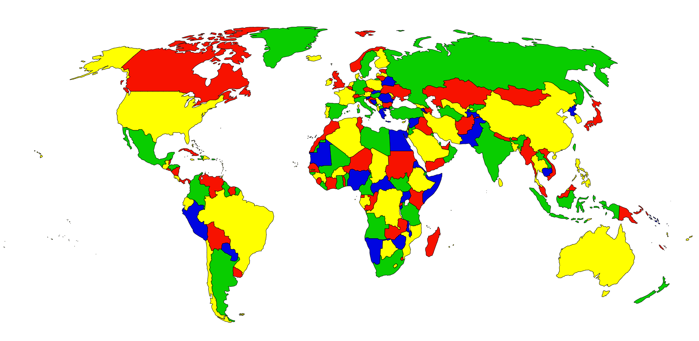

# CSP-Map-Coloring
This repo solves a map-coloring problem with world countries. The map-coloring CSP is to assign a color to each region of a map such that any two regions sharing a border have different colors.

## Table of contents
- [CSP-Map-Coloring](#csp-world-countries)
  - [Table of contents](#table-of-contents)
  - [General info](#general-info)
  - [Technologies](#technologies)
  - [Setup](#setup)
  - [How to use?](#how-to-use)
  - [License](#license)

## General info

The map-coloring CSP is to assign a color to each region of a map such that any two regions sharing a border have different colors.

## Technologies
Project is created with:
* Python 3.8.2
* [REST COUNTRIES](https://restcountries.eu/)

## Setup
To run this project, clone it from GitHub:

```
$ git clone https://github.com/freek9807/CSP-World-Countries.git
```

## How to use?

When you have setup the project, you can run it with:

```
$ python3 main.py
```

When the execution will end, you should see a new file **index.html** with something like this inside:



Enjoy your new Colored map ;-)

## License

[GNU GENERAL PUBLIC LICENSE](https://github.com/freek9807/World-TSP-BB/blob/master/LICENSE) © Federico Pennino
